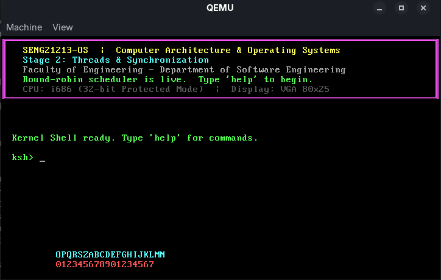
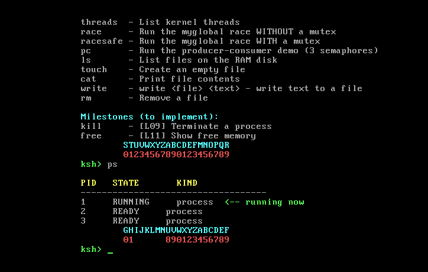
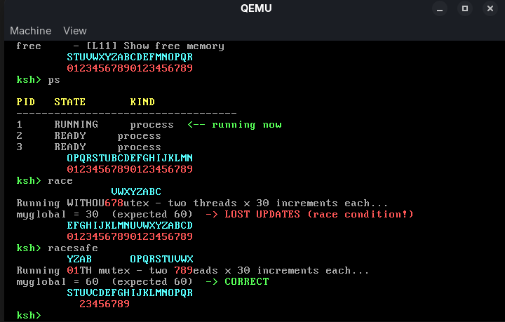
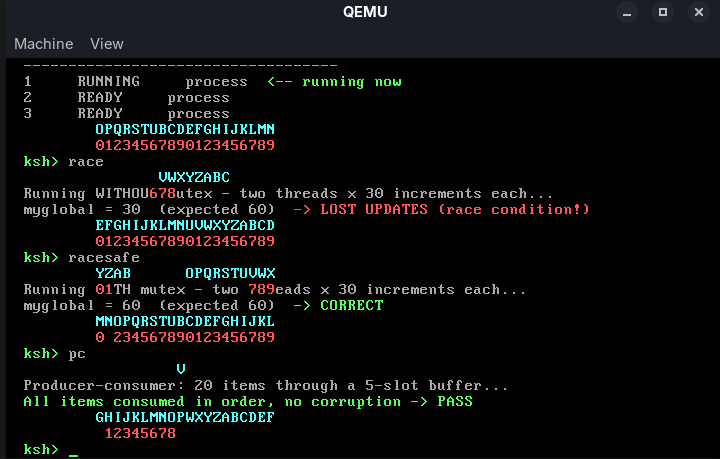
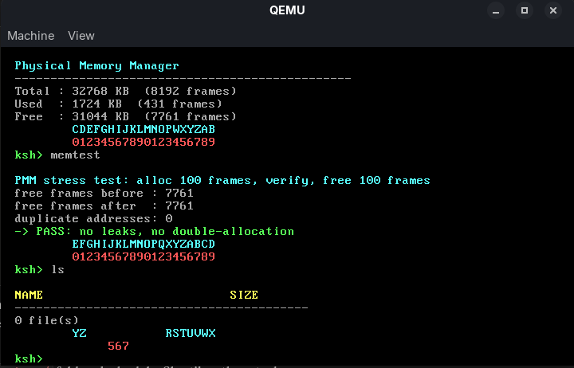
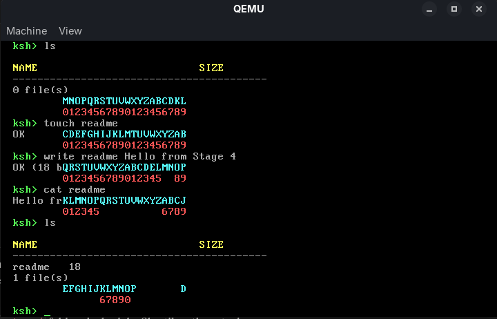
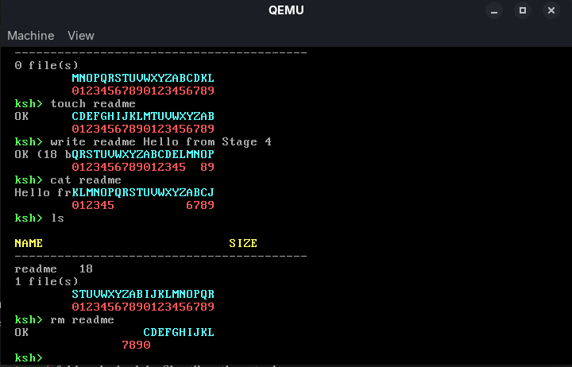

# SENG21213-OS — Stage 0: Kernel Foundations

> **Course**: SENG 21213 – Computer Architecture & Operating Systems  
> **Year**: 2nd Year, Software Engineering  
> **Assignment**: Build your own x86 Operating System

---

## What Is This?

This is **Stage 0** of your semester-long OS assignment. Over 5 lecture milestones
(Lectures 8–12), your team will transform this minimal kernel into a functioning
operating system with process management, threading, memory management, and a
file system.

```
seng21213-os/
├── boot/
│   └── boot.asm          ← MBR Bootloader (NASM, 16-bit → 32-bit transition)
├── kernel/
│   ├── kernel_entry.asm  ← Protected-mode entry, calls kernel_main()
│   ├── kernel.c          ← Main kernel: shell loop, command dispatch
│   ├── vga.c / vga.h     ← VGA 80×25 text-mode driver
│   ├── keyboard.c / .h   ← PS/2 keyboard polling driver
├── include/
│   └── types.h           ← Primitive types (no libc!)
├── linker.ld             ← Linker script (kernel at 0x10000)
├── Makefile              ← Build system
├── Dockerfile            ← Reproducible build environment
└── README.md             ← You are here
```

---

## Milestone Schedule

| Lecture | Milestone | Files to Add |
|---------|-----------|-------------|
| L08 | ✅ Stage 0 – Boot + VGA + Shell | *Given to you* |
| L09 | Process Management | `kernel/process.c`, `kernel/scheduler.c` |
| L10 | Threads & Synchronisation | `kernel/thread.c`, `kernel/mutex.c` |
| L11 | Memory Management | `kernel/pmm.c`, `kernel/vmm.c` |
| L12 | File System | `kernel/fs.c`, `kernel/ramdisk.c` |

---

## Quick Start

### Option A: Docker (Recommended for all platforms)

```bash
# 1. Install Docker Desktop (Windows/Mac) or Docker Engine (Linux)
# 2. Build the image once:
docker build -t seng21213-os-builder .

# 3. Build the OS:
docker run --rm -v "$(pwd)":/os seng21213-os-builder

# 4. Run in QEMU (install QEMU locally):
qemu-system-i386 -drive format=raw,file=seng21213-os.img -m 32M
```

### Option B: Native Linux/WSL2

```bash
# Ubuntu/Debian
sudo apt install nasm gcc gcc-multilib binutils qemu-system-x86 make

# Build
make all

# Run
make run
```

### Option C: macOS (Homebrew)

```bash
brew install nasm x86_64-elf-binutils qemu

# You also need an i686-elf-gcc cross-compiler:
# See: https://wiki.osdev.org/GCC_Cross-Compiler
make all
make run
```

---

## Understanding the Boot Process

```
Power On
  │
  ▼
BIOS (firmware in ROM)
  │  Loads 512-byte MBR from disk sector 1 into RAM at 0x7C00
  ▼
boot/boot.asm  (Real Mode, 16-bit)
  │  Prints "Loading SENG21213-OS..."
  │  Reads 64 sectors (kernel) from disk into RAM at 0x10000
  │  Sets up GDT (Global Descriptor Table)
  │  Switches CPU to 32-bit Protected Mode
  │  Far-jumps to 0x10000
  ▼
kernel/kernel_entry.asm  (Protected Mode, 32-bit)
  │  Calls kernel_main()
  ▼
kernel/kernel.c  →  kernel_main()
  │  vga_init()     – set up text display
  │  kb_init()      – set up keyboard
  │  print_splash() – welcome screen
  │  shell_run()    – interactive shell (infinite loop)
  ▼
Your code from here...
```

---

## Building Lecture 9: Process Management

When you reach Lecture 9, you'll add process support. Here's the interface to implement:

```c
/* kernel/process.h  — you write this! */

#define MAX_PROCESSES    16
#define STACK_SIZE     4096

typedef enum { READY, RUNNING, BLOCKED, TERMINATED } proc_state_t;

typedef struct pcb {
    uint32_t      pid;
    proc_state_t  state;
    uint32_t      esp;          /* Saved stack pointer */
    uint32_t      eip;          /* Saved instruction pointer */
    uint32_t      stack[STACK_SIZE / 4];
    struct pcb   *next;         /* For linked-list ready queue */
} pcb_t;

void   process_init(void);
pcb_t *process_create(void (*entry)(void));
void   process_yield(void);        /* Trigger context switch */
void   process_exit(void);
void   scheduler_tick(void);       /* Called by timer IRQ (Lecture 10) */
```

---

## Debugging Tips

```bash
# Debug with GDB
make run-debug
# In another terminal:
gdb
(gdb) target remote :1234
(gdb) set architecture i386
(gdb) symbol-file build/kernel.elf
(gdb) break kernel_main
(gdb) continue

# Inspect the disk image
xxd seng21213-os.img | head -32    # View MBR
xxd seng21213-os.img | grep -c aa55  # Verify boot signature
```

---

## Key Learning Resources

| Topic | Reference |
|-------|-----------|
| x86 Protected Mode | Intel IA-32 Manual, Vol 3, Chapter 3 |
| VGA Text Mode | OSDev Wiki: Text UI |
| Interrupts / IDT | Stallings Ch.1; OSDev: IDT |
| Process Management | Stallings Ch.3–4 (your lecture notes) |
| Memory Management | Stallings Ch.7–8 (your lecture notes) |
| OSDev community | https://wiki.osdev.org |

---

## Assessment Rubric (per milestone)

| Criterion | Weight |
|-----------|--------|
| Code compiles and kernel boots in QEMU | 30% |
| Feature implementation (correct behaviour) | 40% |
| Code quality and comments | 20% |
| Lab demo and viva questions | 10% |

---

*Happy hacking! Remember: every commercial OS started exactly like this.*

---

## Screenshots

### Boot — Stage 0/1 splash and shell


### Stage 1 — Round-robin scheduler (`ps`)


### Stage 2 — Race condition, with and without a mutex (`race` / `racesafe`)


### Stage 2 — Producer-consumer with 3 semaphores (`pc`)


### Stage 3 — Physical memory manager stress test (`memtest`)


### Stage 4 — Creating and reading a file (`touch` / `write` / `cat` / `ls`)


### Stage 4 — Removing a file (`rm`)


---

## Stage 1 Progress — Process Management (implemented)

**What was built:**
- `kernel/process.h` / `kernel/process.c` — `pcb_t` struct (PID, state, saved ESP/EIP,
  4KB private stack, `next` pointer), a static 16-slot process table, and a
  singly-linked ready queue (`enqueue`/`dequeue`).
- `kernel/idt.h` / `kernel/idt.c` — 256-entry IDT, `lidt` load, PIC remap
  (IRQ0-7 → vectors 32-39, IRQ8-15 → 40-47), and PIT channel 0 programmed
  to 100 Hz (10 ms time slice) via `pit_init()`.
- `kernel/isr.asm` — `irq0_handler`: `pushad` saves the interrupted process's
  registers, calls `scheduler_switch()` (C) with the old ESP, then loads the
  ESP it returns, `popad` + `iretd` resumes the next process.
- `kernel/scheduler.c` — `scheduler_switch()` implements round-robin:
  requeue the process that was just interrupted, dequeue the next one,
  send PIC EOI, return its saved ESP.
- `process_create()` pre-builds a **fake interrupt frame** on a new
  process's stack (dummy EDI/ESI/EBP/EBX/EDX/ECX/EAX, then EIP/CS/EFLAGS)
  so the very first context switch into it works through the same
  `popad`/`iretd` path as every subsequent switch.
- `ps` shell command lists PID + state, marking the currently running one.
- Two demo processes (`demo_process_a`, `demo_process_b`) print characters
  to fixed screen positions at different tick-based rates, proving
  concurrent scheduling.

**Bug fixed during development:** the initial PIC remap unmasked *all*
IRQs, including IRQ1 (keyboard), which has no IDT handler yet (keyboard is
polled, not interrupt-driven) — this froze the keyboard. Fixed by masking
everything except IRQ0 (`outb(0x21, 0xFE)`).

**How to test:**

    make clean && make run

The background counters (cyan letters / red digits, rows 22-23) update on
their own while the shell stays fully responsive — type `ps` to see all
three processes and their state.

**Tag:** `v0.2-stage1`

---

## Stage 2 Progress — Threads, Mutex & Semaphore (implemented)

**What was built:**
- `kernel/process.h`/`.c` refactored: `process_alloc()` is now the shared
  low-level allocator (builds the fake interrupt frame), used by both
  `process_create()` and the new `thread_create()`.
- `kernel/thread.h`/`.c` — kernel threads via a **trampoline pattern**:
  a thread's saved EIP points at `thread_trampoline()`, which reads
  `fn`/`arg` off the current PCB and calls the real function — this is
  how an argument gets passed through when `iretd` can't pass one directly.
- `kernel/mutex.h`/`.c` — spinlock mutex using `cli`/`sti` to make the
  "check-then-set" atomic w.r.t. the timer interrupt, `hlt` while waiting.
- `kernel/semaphore.h`/`.c` — counting semaphore, same `cli`/`sti` pattern.
- `race` / `racesafe` shell commands — two threads increment a shared
  `myglobal` 30 times each. To make the race *deterministic* rather than
  a rare timing accident, each increment is split as
  `load -> int $32 (forced context switch) -> store`, so the interleaving
  is guaranteed every run. Without a mutex this reliably loses updates
  (myglobal ends at 30, not 60); with a mutex it's always correct (60).
- `pc` shell command — classic bounded-buffer producer/consumer with
  3 semaphores (`empty`, `full`, `mutex`), 20 items through a 5-slot
  buffer, verified consumed in order with no corruption.
- `threads` shell command — lists only PCBs with `thread_fn` set,
  distinguishing kernel threads from ordinary processes in `ps`.

**Design notes:**
- Forcing the race with `int $32` instead of a busy-wait delay loop was
  a deliberate choice: at `-O2` a plain `myglobal++` can compile to a
  single atomic memory instruction, and even a split load/delay/store can
  miss the 10ms tick window often enough to look "correct" by luck. An
  explicit software interrupt between load and store guarantees the
  interleaving every single run.

**How to test:**

    make clean && make run

Then in the shell: `race` (expect LOST UPDATES), `racesafe` (expect
CORRECT), `pc` (expect PASS), `threads` (lists active kernel threads).

**Tag:** `v0.3-stage2`

---

## Stage 3 Progress — Physical Memory Manager (implemented)

**What was built:**
- `boot/boot.asm` — `detect_memory` runs BIOS INT 0x15 EAX=0xE820 in Real
  Mode (before the switch to Protected Mode, since BIOS calls aren't
  available afterward). Stores the entry count at 0x8000 and the raw
  24-byte SMAP entries starting at 0x8004.
- `linker.ld` — added a `kernel_end` symbol marking the first byte of
  physical memory not occupied by the kernel image, so the PMM never
  hands out a frame the kernel itself is using.
- `kernel/pmm.h`/`.c` — parses the E820 map, builds a bitmap (1 bit per
  4KB frame) over the first 32MB (matching QEMU's `-m 32M`), starting
  pessimistic (everything marked used) and freeing only BIOS-reported
  usable regions above `kernel_end`. `pmm_alloc_frame()` / `pmm_free_frame()`
  do a first-fit bitmap scan/clear.
- `mem` shell command — reports real total/used/free memory from the PMM
  (previously a hardcoded stub).
- `memtest` shell command — allocates 100 frames, verifies all addresses
  are distinct, frees them all, and confirms the free-frame count returns
  to its exact starting value (proof of no leaks / no double-allocation).

**Design notes:** `kernel_end` is a linker symbol, not a C variable — it
has no value of its own, so it's always read as `&kernel_end` (its
address), never `kernel_end` (which would read whatever bytes happen to
sit at that address).

**How to test:**

    make clean && make run

Then in the shell: `mem` (shows total/used/free), `memtest` (expect PASS).

**Tag:** `v0.4-stage3`

---

## Stage 4 Progress — RAM Disk File System (implemented)

**What was built:**
- `kernel/ramdisk.h`/`.c` — the "disk" is 1MB of physical memory at a
  **fixed address (0x200000 / 2MB)**, reserved from the PMM via
  `pmm_reserve_range()` rather than a `.bss` array. A first attempt used
  a plain static array; that pushed the kernel's own memory footprint
  (`0x10000` load address + text/data/bss) past `0xA0000`, colliding
  with the VGA text buffer at `0xB8000` and blanking the screen. The
  fixed high address sidesteps that entirely.
- `kernel/fs.h`/`.c` — a flat, inode-based filesystem over 4KB blocks:
  block 0 = superblock (magic/counts), block 1 = directory
  (name → inode index, `-1` = empty slot), block 2 = block bitmap,
  block 3 = inode bitmap, block 4 = inode table (64 inodes, 8 direct
  block pointers each, max file size 32KB), blocks 5+ = data.
  The file name lives in the directory entry, not the inode — the same
  separation real Unix filesystems use to allow hard links.
- Shell commands: `ls`, `touch <file>`, `cat <file>`,
  `write <file> <text>`, `rm <file>` — all backed by the fs API
  (`fs_write`/`fs_read`/`fs_unlink`/`fs_list`/`fs_size`).

**Bug fixed during development:** seeing a blank QEMU screen after
adding the RAM disk led to checking `size build/kernel.elf` — `.bss`
had jumped to ~1.1MB, meaning the kernel's own address range extended
past the `0xA0000–0xFFFFF` VGA/BIOS hole. Moved the RAM disk to a fixed
physical address instead of letting the linker place it in `.bss`.

**How to test:**

    make clean && make run

Then: `ls` (0 files) → `touch readme` → `write readme Hello from Stage 4`
→ `cat readme` → `ls` (readme, size shown) → `rm readme` → `ls` (0 files).
Verified with 5 files created via `touch a` .. `touch e` and listed with `ls`.

**Known limitation:** arrow keys and copy/paste don't work in the shell —
inherited from the Stage 0 keyboard driver, which doesn't handle the
`0xE0`-prefixed extended scancodes arrow keys send. Doesn't affect any
Stage 0–4 deliverable; listed here for transparency.

**Tag:** `v0.5-stage4`

---

## Bonus Extension — Command History & Cursor Editing

**What was built (Stage 0 extension, implemented after Stage 4):**
- Fixed a bug where arrow keys were misread as numpad digits — PS/2
  extended keys (arrows, Home/End, etc.) send a `0xE0` prefix byte
  before their real scancode; the original driver didn't check for it,
  so the byte following `0xE0` fell straight through the normal
  translation table and aliased onto the numpad row.
- `vga_get_cursor()` added so `kb_readline()` can remember where a line
  started and redraw it in place after an edit.
- `kb_getchar()` now returns `int`, not `char`, so arrow keys can be
  signalled as values above the ASCII range (`KB_KEY_UP/DOWN/LEFT/RIGHT`,
  defined `> 0xFF` so they can never collide with a real character).
- `kb_readline()` rewritten to support:
  - **Left/Right** — move the edit cursor within the current line,
    inserting/deleting at that position (not just at the end).
  - **Up/Down** — browse a 20-entry ring-buffer command history.

**How to test:**

    make clean && make run

Type a few commands, then press Up to recall the last one, Up again for
the one before that, Down to go forward again. Press Left/Right and
retype a character in the middle of a line to confirm in-place editing.

**Design note:** `redraw_line()` assumes the edited line fits on one
VGA row (true for normal shell commands); a `write` command long enough
to wrap would throw off the column math used to reposition the cursor.

---

## Bonus Extension — Full ISO Keyboard Layout (CapsLock, AltGr)

**What was built:**
- **CapsLock** (scancode `0x3A`) — toggles a `capslock_on` flag (not a
  held-key state like Shift). Applied by flipping the case of whatever
  character the Shift-state produced, so CapsLock+Shift on a letter
  correctly cancels out to lowercase, matching real keyboard behaviour.
- **AltGr** (right Alt, `E0 38` press / `E0 38` release under the `0xE0`
  extended prefix) — detected as a separate modifier from left Alt
  (which sends the same `0x38` but with no `E0` prefix). One worked
  mapping is implemented as a demonstration: `AltGr+2` → `@`, the same
  combination many European ISO keyboard layouts use. A full
  accented-character table is layout-specific and out of scope for a
  teaching kernel, but the modifier-detection mechanism is fully
  general and can be extended with more mappings.

**How to test:**

    make clean && make run

Press CapsLock, type letters (uppercase); press CapsLock again, type
letters (lowercase, unaffected). Hold the right Alt key and press `2`
for `@`.

**Lecture concept:** L08 §3 — interrupt-driven I/O / scancode handling
(specifically PS/2 Set 1's extended `0xE0` prefix and toggle vs.
held-key modifier state).

---

## Bonus Extension — VGA Scrollback Buffer (Page Up / Page Down)

**What was built:**
- `kernel/vga.c` — a 100-line ring buffer (`history[]`). Every time
  `scroll_up()` is about to discard the top row, that row is copied
  into history first instead of being lost.
- `vga_scroll_view(delta)` — on first scrolling back, snapshots the
  live screen (`live_snapshot[]`) so it can be restored exactly, then
  renders a window of `history[]` + `live_snapshot[]` at the requested
  offset. `vga_scroll_reset()` restores the live snapshot and returns
  to offset 0.
- `kernel/keyboard.c` — Page Up/Page Down (`E0 49` / `E0 51`) scroll by
  10 lines; any other key while browsing scrollback snaps back to the
  live view first, then handles that key normally — the same behaviour
  a real terminal has when you start typing while scrolled up.

**Known limitation:** background demo processes (`demo_process_a/b`)
write directly to VGA memory every tick regardless of scrollback state,
so a stray character can bleed into the scrollback view between
Page Up presses. Cosmetic only — the underlying history data is correct.

**How to test:**

    make clean && make run

Run `help` a few times until the screen scrolls, then press Page Up
(repeatedly) to scroll back through history, Page Down to come forward,
and type anything to snap back to the live prompt.

**Lecture concept:** L07 §5 — VGA memory mapping (treating the text
buffer as a ring of rows rather than a fixed screen).

---

## Bonus Extension — ANSI Escape-Code Colour Support

**What was built:**
- `vga_puts_ansi()` (in `vga.c`) parses a minimal subset of ANSI SGR
  (Select Graphic Rendition) sequences: `ESC[<n>;<n>...m`. Supported
  codes: `0` (reset), `1` (bold -> bright colour), `30`-`37`
  (foreground colour). Anything else inside the brackets is parsed but
  ignored -- unsupported codes have no effect rather than corrupting
  output.
- `ansi` shell command demos it: prints all 7 base colours, then 3
  bold/bright variants, using embedded `\x1b[...m` sequences.

**How to test:**

    make clean && make run

Type `ansi` at the shell -- Red/Green/Yellow/Blue/Magenta/Cyan/White,
then Bold Red/Green/Blue in brighter shades.

**Lecture concept:** L07 §5 — memory-mapped I/O (parsing an escape
sequence out of a text stream and translating it into VGA attribute
bytes rather than printable characters).

---

## Bonus Extension — sleep(ms) with Sorted Wake Queue

**What was built:**
- `pcb_t` gained a `wake_tick` field (Extension addition).
- `sleep_ms(ms)` (in `scheduler.c`) converts milliseconds to ticks
  (100Hz -> 10ms/tick), sets the calling process's `wake_tick`, marks
  it `BLOCKED`, and immediately triggers a software interrupt
  (`int $32`) to force a context switch away from it right now, instead
  of waiting out the rest of its current time slice.
- `scheduler_switch()` now checks state before requeuing: a process
  that set itself to `BLOCKED` (i.e., just called `sleep_ms`) is left
  OUT of the ready queue, unlike a normal preemption which always
  requeues as `READY`.
- `process_wake_ready(now)` runs every tick, scanning for any `BLOCKED`
  process whose `wake_tick` has arrived and handing it back to the
  ready queue.
- `demo_process_a`/`demo_process_b` were rewritten to call `sleep_ms()`
  instead of busy-checking `scheduler_ticks()` in a loop — they now
  spend most of their time genuinely `BLOCKED` (visible in `ps`), not
  spinning and burning CPU while waiting.

**How to test:**

    make clean && make run

Run `ps` a few times in a row — PID 2 and 3 should show `BLOCKED` most
of the time (they're asleep between prints), briefly flipping to
`READY`/`RUNNING` right when their 200ms/500ms timer fires.

**Lecture concept:** L09 §3 — process state transitions (this is the
first place `BLOCKED` is actually used for something real, rather than
mutex/semaphore's busy-wait-with-hlt approach from Stage 2).

---

## Bonus Extension — fork() (Duplicate PCB + Stack)

**What was built:**
- `pcb_t` gained `fork_requested` and `fork_return_value` fields.
- `fork()` (in `process.c`) sets `fork_requested = true` on the calling
  process, then forces a context switch with `int $32` -- this is the
  only way to get a VALID, live snapshot of the caller's stack pointer
  (a PCB's `esp` field is stale while that process is actively running;
  it's only correct immediately after a context switch saves it).
- `process_do_fork(parent_esp)`, called from inside `scheduler_switch()`
  where `parent_esp` is that just-saved, valid pointer, does the actual
  work: finds a free PCB, copies the ENTIRE stack array byte-for-byte
  (every local variable and the pushad+iret frame `int $32` just built),
  then translates `esp` -- the one pointer that strictly needs fixing
  up, since it points into the PARENT's stack array in memory. The
  translation preserves the same *depth* from the top of the stack, in
  the CHILD's own (differently located) stack array. Everything else on
  the copied stack (the stale "saved ESP" slot `pushad` wrote) doesn't
  need fixing because `popad` never reads it back.
- Each side is told which one it is via `fork_return_value`: `0` for
  the child's copy, the new PID for the parent's original -- both
  resume from the exact same point (right after `int $32` inside
  `fork()`), just with different return values, matching real
  UNIX `fork()` semantics.
- `forktest` shell command demos it; the child calls `process_exit()`
  immediately after printing, rather than falling back into
  `shell_run()`'s loop and fighting the parent for the same keyboard
  input.

**How to test:**

    make clean && make run

Type `forktest` -- both a `[CHILD]` and `[PARENT]` message print (the
parent showing the child's new PID), then the shell continues normally.

**Design limitation:** since this kernel has no paging/virtual memory,
a "perfect" `fork()` would need to scan the copied stack for any other
pointer values that happen to reference addresses inside the parent's
stack array and rewrite them too (e.g. a saved EBP frame-pointer chain
crossing between locals). At `-O2`, GCC omits frame pointers for
simple functions, so this doesn't come up for the `forktest` demo, but
a `fork()` called from a deeply nested, complex call chain could
break. A production kernel solves this with virtual memory instead
(every process's stack lives at the same virtual address).

**Lecture concept:** L09 §2 — process creation (specifically why only
`esp` needs translating, and why `current_process->esp` is only valid
right after a switch, not while a process is actively executing).

---

## Bonus Extension — MLFQ Scheduler (3 Priority Levels)

**What was built:**
- The single ready queue became an array of 3 (`ready_head[level]` /
  `ready_tail[level]`, level 0 = highest priority). `pcb_t` gained a
  `priority` field.
- **Demote:** in `scheduler_switch()`, a process that used its FULL
  time slice (a normal preemption, `state == RUNNING`, not a voluntary
  block) gets `priority++` before being requeued -- CPU-bound
  behaviour is penalised.
- **Boost:** in `process_wake_ready()`, a process waking from a
  voluntary `sleep_ms()`/block gets `priority--` before being
  requeued -- I/O-bound/interactive behaviour is rewarded.
- **Anti-starvation:** every 500 ticks (5s at 100Hz), `process_boost_all()`
  resets every non-terminated process to priority 0 and physically
  drains queues 1/2 back into queue 0, so a long-running low-priority
  job can never be starved forever.
- `cpuhog` shell command spawns a pure busy-loop process (never sleeps)
  to demonstrate demotion; `ps` now shows a `PRIO` column.

**How to test:**

    make clean && make run

Run `cpuhog` a couple of times, then `ps` repeatedly -- the cpuhog
PIDs demote to priority 2 within a few ticks, while the existing
`sleep_ms`-based demo processes (PID 2/3) stay boosted near priority 0.

**Honest observation:** the interactive shell (PID 1) *also* demotes
to priority 2 during normal use. This isn't a bug -- the keyboard
driver is a busy-poll loop (Stage 0's design, interrupt-driven
keyboard was never implemented), so from the scheduler's point of view
"waiting for a keypress" looks identical to "burning CPU", and gets
penalised the same way a real CPU-bound job would. A real interactive
shell would need an interrupt-driven keyboard (or an explicit
`sleep_ms(1)` between polls) to be correctly recognised as I/O-bound.

**Lecture concept:** L09 §4 — scheduling algorithms (multi-level
feedback queues, and the classic aging/starvation-prevention problem).

---

## Bonus Extension — Priority Inheritance in Mutex

**What was built:**
- `mutex_t` gained `owner` (which PCB currently holds it) and
  `owner_saved_priority` (its priority before any inheritance boost).
- `mutex_lock()`: while waiting, if the caller is higher priority
  (lower number) than the current owner, the owner's priority is
  boosted to match right away -- before the classic priority-inversion
  scenario (a medium-priority process starving out a low-priority lock
  holder that a high-priority process is waiting on) can happen.
- `mutex_unlock()`: restores the owner's priority to what it was
  before any boost.
- `priotest` shell command demos it with three threads: LOW acquires
  the mutex and holds it doing tick-bound CPU work (~300ms of
  scheduled time, not a fixed iteration count, so the demo is
  consistent regardless of host CPU speed), MEDIUM is a pure CPU hog
  that never touches the mutex at all, HIGH waits briefly then blocks
  on the mutex, and the time it waits is measured in ticks.

**How to test:**

    make clean && make run

Run `priotest` -- HIGH should acquire the mutex within roughly the
time LOW's critical section takes (tens of ticks), not stalled by
MEDIUM's unrelated CPU hogging.

**Lecture concept:** L10 §4 — priority inversion (the specific failure
mode this classic OS bug describes: a HIGH priority task blocked
indefinitely by a MEDIUM priority task with no direct relationship to
the lock at all).

---

## Bonus Extension — Read-Write Lock (rwlock_t)

**What was built:**
- `rwlock_t` (`kernel/rwlock.h`/`.c`): `reader_count`, `writer_active`,
  and `writer_waiting` flags, using the same `cli`/`sti` spinlock
  pattern as `mutex.c`.
- `rwlock_read_lock()`: multiple readers can hold it simultaneously
  (increments `reader_count`); blocks only if a writer is active OR
  waiting.
- `rwlock_write_lock()`: sets `writer_waiting = 1` immediately (before
  spinning), which stops any NEW reader from joining -- this is the
  writer-starvation fix. Readers already in when the writer arrives
  still finish normally; once `reader_count` reaches 0, the writer
  gets exclusive access.
- `rwtest` shell command demos it: 3 reader threads acquire and print
  the live reader count (showing 1, 2, then 3 concurrently), then 1
  writer thread waits for all of them to finish before writing
  exclusively.

**How to test:**

    make clean && make run

Run `rwtest` -- all 3 `[READER n] acquired` messages appear with
increasing "active readers" counts before any release, proving they
overlap; the writer only gets in afterward.

**Lecture concept:** L10 §5 — concurrency patterns (specifically the
readers-writers problem and the classic starvation failure mode a
naive implementation has).

---

## Bonus Extension — Deadlock Detector (Resource-Allocation Graph, DFS)

**What was built:**
- `kernel/deadlock.h`/`.c` -- an opt-in resource-allocation graph
  tracker: `deadlock_register_resource()`, `deadlock_note_owner()`,
  `deadlock_note_waiting()`, `deadlock_note_done_waiting()`, and
  `deadlock_check()`.
- `deadlock_check()` walks the graph from every waiting process:
  process -> resource it wants -> that resource's owner -> the
  resource THAT owner wants -> ... If the chain loops back to the
  starting process, that is a cycle -- a deadlock.
- `deadlocktest` shell command spawns a classic AB-BA deadlock: T1
  locks A then wants B, T2 locks B then wants A. `deadlockcheck` scans
  the graph and reports whether a cycle exists.
- `process_index_of()` (added to `process.c`) maps a PCB pointer back
  to its slot in the process table, so the detector can key its
  wait-for graph cheaply.

**How to test:**

    make clean && make run

Run `deadlocktest`, wait a moment for both threads to block, then run
`deadlockcheck` -- it reports "DEADLOCK DETECTED".

**Lecture concept:** L11 §2 — Coffman conditions (mutual exclusion,
hold-and-wait, no preemption, circular wait -- this demo constructs
all four deliberately to trigger the cycle the detector is built to find).

---

## Bonus Extension — kmalloc/kfree (Slab-Style Heap Allocator)

**What was built:**
- `kernel/kmalloc.h`/`.c` -- a variable-size heap allocator sitting
  entirely on top of the existing frame allocator (`pmm.c` is
  untouched). Each "arena" is one 4KB frame obtained from
  `pmm_alloc_frame()`, carved into a singly-linked free list of
  blocks. `kmalloc()` first-fits within existing arenas, splitting a
  block if there's meaningfully more room than requested, and only
  requests a fresh page from the PMM when nothing existing fits.
  `kfree()` marks a block free for reuse (no neighbour-coalescing, to
  keep it simple -- some fragmentation over time is the tradeoff).
- `kmtest` shell command allocates 3 blocks of different sizes, writes
  distinct patterns into each, frees one, allocates a new block
  (verifying it can reuse the freed space), and confirms every other
  allocation's data is still intact and untouched.

**How to test:**

    make clean && make run

Run `kmtest` -- expect `PASS: allocations isolated, data intact after free/reuse`.

**Lecture concept:** L11 §5 — memory allocation strategies (variable-size
heap allocation built on top of fixed-size physical frames).

---

## Bonus Extension — Single-Indirect Block Pointer

**What was built:**
- Extended each inode from 8 direct block pointers to 8 direct pointers plus
  one single-indirect pointer block.
- Files up to 32 KB use direct blocks only.
- Beyond 32 KB, the indirect block stores up to 1024 additional 32-bit
  RAM-disk block numbers.
- The inode can theoretically address 4,227,072 bytes (~4.03 MiB), although
  the current teaching RAM disk is only 1 MiB.
- The indirect table is allocated lazily.
- Truncate/unlink release direct blocks, indirect data blocks, and the
  indirect-table block.
- `cat` now uses a bounded display buffer instead of allocating the new
  maximum file size in kernel BSS.

**How to test:**

    make clean && make run
    indirecttest

Expected:

    PASS: 40KB+ write/read crossed direct -> indirect boundary
    PASS: data verified byte-for-byte and blocks released on unlink

The test writes 41,083 bytes, reads it back, verifies every byte, and then
deletes the test file.

**Lecture concept:** L12 §2 — i-node indirection / single-indirect block addressing.

---

## Bonus Extension — Subdirectories (`mkdir`, `cd`, `pwd`)

**What was built:**
- Added inode types for regular files and directories.
- Reserved inode 0 as the root directory `/`.
- Directory entries now store a parent inode, allowing a hierarchical namespace.
- Added `mkdir <name>` to create subdirectories.
- Added `cd <name>`, `cd ..`, and `cd /` navigation.
- Added `pwd` to reconstruct and display the current working directory.
- Existing `touch`, `write`, `cat`, `rm`, and `ls` now operate relative to the current directory.
- Different directories can contain files with the same name independently.

**How to test:**

    make clean && make run
    dirtest

Expected:

    PASS: mkdir + nested cd + pwd hierarchy works
    PASS: nested file write/read and parent navigation work

Manual namespace test:

    cd /
    touch readme
    write readme RootFile
    cat readme

    cd docs
    cat readme

The root file prints `RootFile`, while `/docs/readme` keeps its own contents.

Regression test:

    cd /
    indirecttest

The single-indirect block test should continue to pass after enabling
hierarchical directories.

**Lecture concept:** L12 §3 — hierarchical file systems.

---

## Bonus Extension — Virtual File System (VFS) Abstraction

**What was built:**
- Added a generic Virtual File System layer in `kernel/vfs.c` and `kernel/vfs.h`.
- Added a `file_ops_t` function-pointer table (vtable) for filesystem operations.
- Registered the existing RAM-disk filesystem as the current VFS backend.
- Added generic `vfs_*` operations for:
  - read
  - write
  - unlink
  - size
  - list
  - mkdir
  - chdir
  - getcwd
  - directory checks
- Shell filesystem commands now use the VFS interface rather than calling
  the concrete `fs_*` implementation directly.
- The current backend is named `ramfs`.
- The design allows another filesystem implementation to be attached later
  by providing another `file_ops_t` table.

**Architecture:**

    Shell / Kernel
         |
         v
       vfs_*()
         |
         v
     file_ops_t
         |
         v
      ramfs_ops
         |
         v
       fs_*()

**How to test:**

    make clean && make run
    vfstest

Expected:

    Backend: ramfs
    PASS: write/read/size/unlink dispatched through file_ops_t
    PASS: RAM filesystem is hidden behind generic VFS API

Regression tests:

    dirtest
    indirecttest

Both tests should continue to pass through the VFS layer.

**Lecture concept:** L12 §3 — Virtual File System design.

---

## Bonus Extension — Buddy Physical-Memory Allocator

**What was built:**
- Added a buddy allocator in `kernel/buddy.c` and `kernel/buddy.h`.
- Reserved a 1 MiB aligned physical-memory pool from the existing PMM.
- The pool contains 256 pages of 4 KiB each.
- Supports allocation orders 0 through 8:
  - order 0 = 4 KiB
  - order 1 = 8 KiB
  - order 2 = 16 KiB
  - ...
  - order 8 = 1 MiB
- Larger blocks are recursively split when a smaller allocation is needed.
- On free, the allocator calculates the matching buddy using XOR and
  recursively coalesces matching free blocks.
- Added `pmm_alloc_contiguous()` to reserve an aligned contiguous region
  from the existing bitmap PMM.
- The existing bitmap PMM and `kmalloc/kfree` heap remain operational.

**How to test:**

    buddytest

Expected:

    PASS: order-0/1/2 allocations split larger buddy blocks
    PASS: free blocks coalesced back into one 1 MiB order-8 block

Regression tests:

    memtest
    kmtest

Both existing memory-management tests should continue to pass.

**Bootloader note:**
Adding the buddy allocator increased the kernel above the original 32 KiB
bootloader load window. The loader was therefore expanded from 64 sectors
to 96 sectors (48 KiB), and the Makefile now checks that `kernel.bin`
does not silently exceed that configured limit.

**Lecture concept:** Stage 3 — buddy allocator / physical memory management.

---

## Bonus Extension — Write-Ahead Metadata Journaling

**What was built:**
- Added a redo-style write-ahead journal in `kernel/journal.c` and
  `kernel/journal.h`.
- Reserved RAM-disk blocks 5-9 for the journal:
  - block 5: journal header
  - blocks 6-9: redo copies of filesystem metadata blocks
- Filesystem data blocks now begin at block 10.
- Metadata for directory entries, inode bitmap, block bitmap, and inode
  table is modified through a transaction shadow before reaching its
  normal home blocks.
- Journal commits follow write-ahead ordering:
  1. write redo metadata copies
  2. mark transaction PREPARED
  3. write COMMITTED marker
  4. replay/checkpoint metadata to home blocks
  5. clear the journal
- Each logged metadata block has a checksum.
- `write`, `unlink`, and `mkdir` operations use journal transactions.
- File replacement uses ordered copy-on-write so replacement data is
  written before the new metadata is committed.

**Recovery test:**

    journaltest

The test deliberately leaves a valid COMMITTED transaction in the journal
without checkpointing it to the normal metadata blocks. It then invokes
recovery and verifies that the redo log restores the new metadata and file.

Expected:

    PASS: committed redo log survived simulated crash point
    PASS: recovery replayed metadata before clearing journal
    PASS: recovered file data matched byte-for-byte

**Regression tests:**

    dirtest
    indirecttest
    vfstest
    buddytest
    memtest
    kmtest

All previous features should continue to pass.

**Important limitation:**
The teaching RAM disk is volatile and is cleared by `ramdisk_init()` on each
kernel boot. Therefore the test simulates a crash between journal commit and
checkpoint inside one boot session. It demonstrates write-ahead ordering and
redo recovery, but not persistence across a real power cycle.

**Lecture concept:** Stage 4 / L12 — write-ahead journaling and recovery.

### QEMU Scrollback Controls

The VGA console keeps a 100-line scrollback history.

- `Page Up` / `Page Down` browse previous console output.
- `F11` / `F12` provide QEMU/laptop-friendly scroll-up and scroll-down controls.
- Typing another key automatically returns to the live shell view.

---

## Bonus Extension — GRUB2 Multiboot Boot Support

**What was built:**
- Added a Multiboot v1 header recognized by GRUB2.
- Added a separate GRUB-linked kernel image at the conventional 1 MiB
  load address.
- Preserved the original custom BIOS bootloader as an alternative boot path.
- Added a kernel-owned flat GDT so both the custom loader and GRUB enter
  the kernel with the same segment layout.
- Added a kernel-owned 16 KiB stack.
- Added Multiboot memory-map support:
  - GRUB passes its memory information through the Multiboot structure.
  - The kernel converts it into the E820-style format already consumed by
    the physical memory manager.
- Added Makefile targets:
  - `make grub-check`
  - `make grub-iso`
  - `make run-grub`

**Verification:**

    make grub-check

Expected:

    GRUB2 recognizes build/kernel-grub.elf as x86 Multiboot

Build and boot:

    make grub-iso
    make run-grub

Successful GRUB boot displays:

    [BOOT] GRUB2 Multiboot detected - memory map imported

The normal kernel shell then starts and all existing subsystem tests can be
run through the GRUB boot path.

**Boot paths:**

    Custom BIOS loader -> kernel at 0x10000
    GRUB2 Multiboot    -> kernel ELF at 0x100000

Both paths enter the same kernel code.
